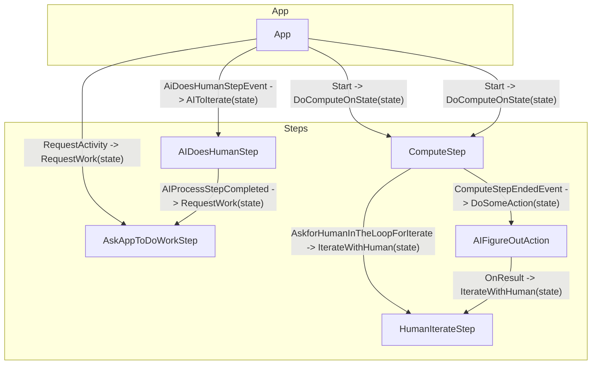

```mermaid
flowchart TD
    ce32fd3d268a47bdbfc19fef519bc3fb -- "Start -> DoComputeOnState(state)" --> 1340f5dff11e44d48b21fc660000c928
    ce32fd3d268a47bdbfc19fef519bc3fb -- "Start -> DoComputeOnState(state)" --> 1340f5dff11e44d48b21fc660000c928
    ce32fd3d268a47bdbfc19fef519bc3fb -- "AiDoesHumanStepEvent -> AIToIterate(state)" --> a09f8e7cd7c8477aafca372b233528e0
    ce32fd3d268a47bdbfc19fef519bc3fb -- "RequestActivity -> RequestWork(state)" --> bce29cdfbc2c473fbed1176b8790723d
    1340f5dff11e44d48b21fc660000c928 -- "ComputeStepEndedEvent -> DoSomeAction(state)" --> 48acf196ad1143e99c6eb8c1d838479a
    1340f5dff11e44d48b21fc660000c928 -- "AskforHumanInTheLoopForIterate -> IterateWithHuman(state)" --> 5894dc6e3f1f4dd28c1572346dd9494e
    48acf196ad1143e99c6eb8c1d838479a -- "OnResult -> IterateWithHuman(state)" --> 5894dc6e3f1f4dd28c1572346dd9494e
    a09f8e7cd7c8477aafca372b233528e0 -- "AIProcessStepCompleted -> RequestWork(state)" --> bce29cdfbc2c473fbed1176b8790723d
    subgraph App
        ce32fd3d268a47bdbfc19fef519bc3fb[App]
    end
    subgraph Steps
        1340f5dff11e44d48b21fc660000c928[ComputeStep]
        48acf196ad1143e99c6eb8c1d838479a[AIFigureOutAction]
        5894dc6e3f1f4dd28c1572346dd9494e[HumanIterateStep]
        a09f8e7cd7c8477aafca372b233528e0[AIDoesHumanStep]
        bce29cdfbc2c473fbed1176b8790723d[AskAppToDoWorkStep]
    end
```