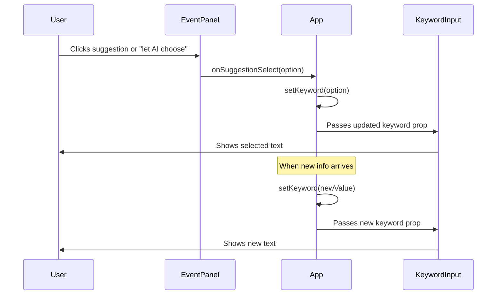

# Plan: Sync Input Text with Suggestion or "Let AI Choose" Selection

## Objective

When a user selects a suggestion or "let AI choose" in the React client, the main input text should immediately update to reflect that choice and remain so until new information arrives.

---

## Implementation Steps

1. **Update Data Flow**
    - Add a callback prop to `EventPanel` (e.g., `onSuggestionSelect`).
    - In `App.tsx`, define a handler that updates the `keyword` state and pass it to `EventPanel`.
    - In `EventPanel.tsx`, call this handler with the selected suggestion or "let AI choose" value when a suggestion is selected.

2. **UI Synchronization**
    - The `KeywordInput` component will automatically reflect the updated `keyword` prop.
    - When new information arrives (e.g., via websocket or state update), reset or update the `keyword` as needed in `App.tsx`.

3. **"Let AI Choose" Handling**
    - If "let AI choose" is a special option, treat it as a suggestion and update the input accordingly.

---

## Sequence Diagram

---

## Component Responsibility Table

| Component      | Responsibility                                              |
|----------------|------------------------------------------------------------|
| App            | Holds `keyword` state, updates on suggestion or new info   |
| EventPanel     | Renders suggestions, calls handler on selection            |
| KeywordInput   | Displays and edits current keyword                         |

---

## Next Steps

1. Add `onSuggestionSelect` prop to `EventPanel`.
2. Update `App.tsx` to handle suggestion selection and pass handler.
3. Update `EventPanel.tsx` to call handler on suggestion click.
4. Ensure new information resets/updates the keyword as needed.