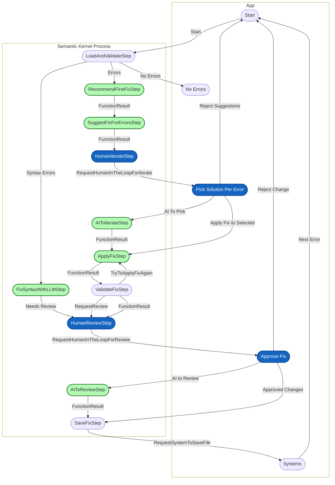

# YamlFixPicksIterator Step/Event Flow

This diagram visualizes the step-by-step Picks and event-driven transitions in the YamlFixPicksIterator. Each block represents a Picksing step, and arrows show how events trigger transitions between steps. Event names are labeled on the connections, making it clear how the Picks flows and where human-in-the-loop actions are required.

The `ConsoleKernelPicksMessageChannel` is the communication bridge for human-in-the-loop events. When the Picks emits events such as `WaitingOnHumanIterate`, `WaitingOnHumanReview`, `WaitingOnHumanSaveFile`, or `WaitingOnHumanFinished`, they are sent to this channel. The channel then waits for user input and sends the corresponding event back into the Picks to continue execution.

