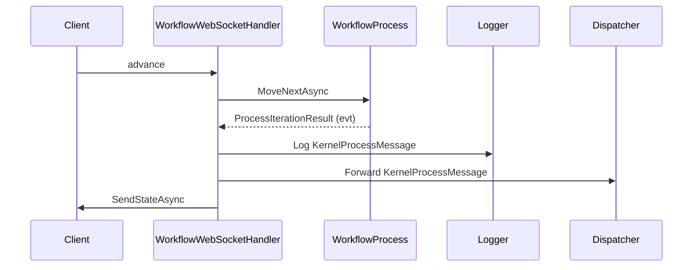

# Semantic Kernel Workflow Observability Plan

## 1. Message Definition

Add a `KernelProcessMessage` class to a shared location:

```csharp
public class KernelProcessMessage
{
    public string Type { get; set; }
    public string StepName { get; set; }
    public string CorrelationId { get; set; }
    public string UserId { get; set; }
    public DateTime TimestampUtc { get; set; }
    public object Payload { get; set; }
}
```

---

## 2. Intercept and Log/Forward

- In `WorkflowWebSocketHandler.AdvanceWorkflowAndDispatchAsync`, after retrieving `evt`, check if the workflow state contains a serialized `KernelProcessMessage` (e.g., in a known property or via a convention).
- If present, deserialize, log, and forward using a dispatcher interface.

---

## 3. Dispatcher Abstraction

- Define `IMessageDispatcher` and implement for your infra (Dapr, Orleans, etc.).
- Register via DI and inject into `WorkflowWebSocketHandler`.

---

## 4. Optional: Global Monitoring

- For step-level observability, implement an `IProcessExtension` and register it when building the workflow.

---

## 5. Mermaid Diagram



---

## 6. Next Steps

- Confirm the property name or convention for passing `KernelProcessMessage` in workflow state.
- Implement the interception, logging, and forwarding logic in `AdvanceWorkflowAndDispatchAsync`.
- Add dispatcher and (optionally) global extension.