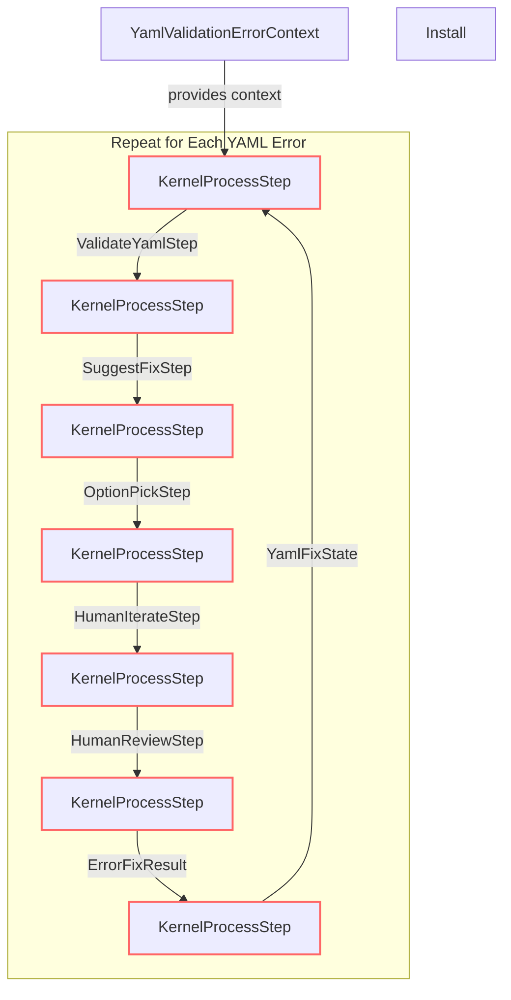

# AICreateAndIterate: Error Fixing and Human Interaction Flow

This module automates the process of detecting, suggesting, and iteratively fixing YAML configuration errors, with human-in-the-loop steps for review and decision-making. It is designed to handle multiple errors and supports both automated and manual correction cycles.

## How It Works

### Event-Driven Steps

1. **Validation** (`ValidateYamlStep`):  
   - Scans the YAML for errors.
   - On input event "Start", triggers validation.
   - On function result, sends event to `SuggestFixStep`.

2. **Suggestion** (`SuggestFixStep`):  
   - Proposes automated fixes for each error.
   - Emits "AutoFixReady" to apply fix, "OptionsReady" to present options, or "IterateRequired" to start human iteration.
   - Sends events to `OptionPickStep`, `HumanIterateStep`, or apply step accordingly.

3. **Option Picking** (`OptionPickStep`):  
   - Emits "ShowOptions" to present suggestions to the user.
   - Waits for user choice, then sends event to apply step.

4. **Human Iteration** (`HumanIterateStep`):  
   - Emits "NeedIteration" to request human input or refinement.
   - On function result, sends event back to `SuggestFixStep` for further suggestions.

5. **Human Review** (`HumanReviewStep`):  
   - Emits "PresentSuggestions" for final user review.
   - On approval, proceeds to apply the fix.

6. **Result and State Tracking** (`ErrorFixResult`, `YamlFixState`):  
   - Records the outcome and tracks progress.
   - On function result, sends event to revalidate or continue loop.

7. **Looping for Multiple Errors**:  
   - The above steps are repeated for each error until all are resolved or deferred.

**Events and transitions orchestrate the flow between steps, enabling both automated and human-in-the-loop correction.**

## Mermaid Diagram

## Human Interaction

- The user is involved at the **OptionPickStep** (choosing a fix), **HumanIterateStep** (editing/refining), and **HumanReviewStep** (final approval).
- The system supports iterative cycles, allowing the user to revisit and refine fixes as needed.

## Summary

This flow ensures robust error handling with both automated and human-guided correction, supporting complex YAML validation scenarios with multiple errors and iterative human input.
